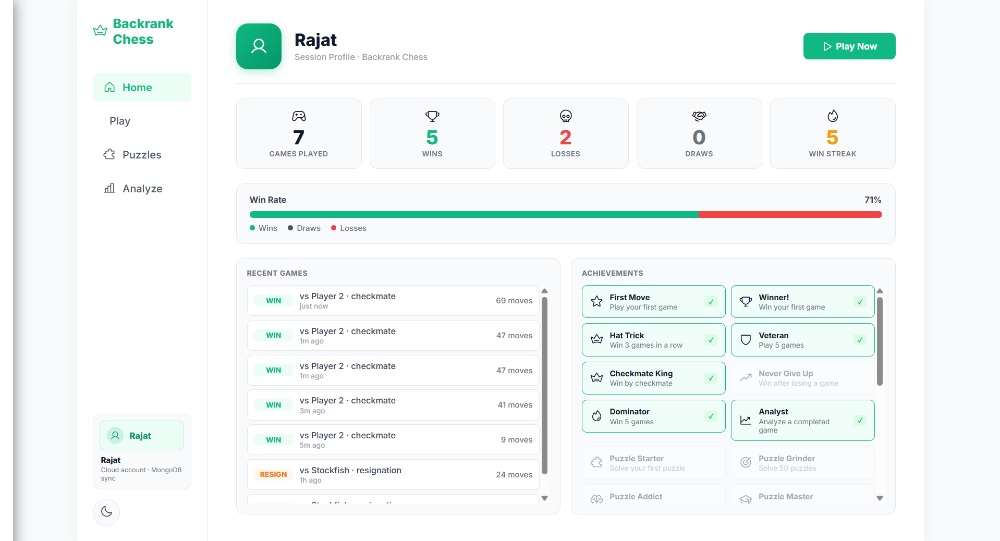
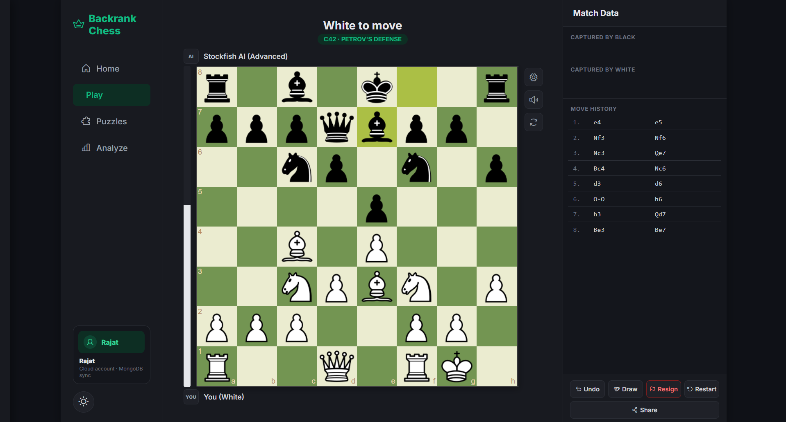
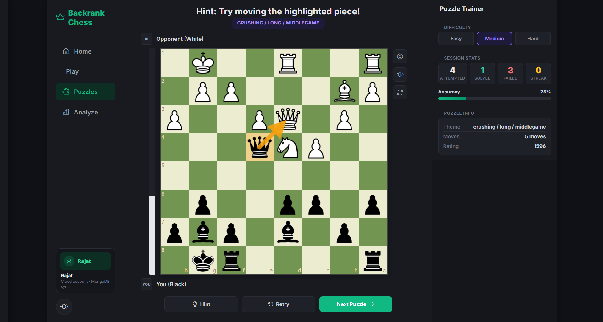
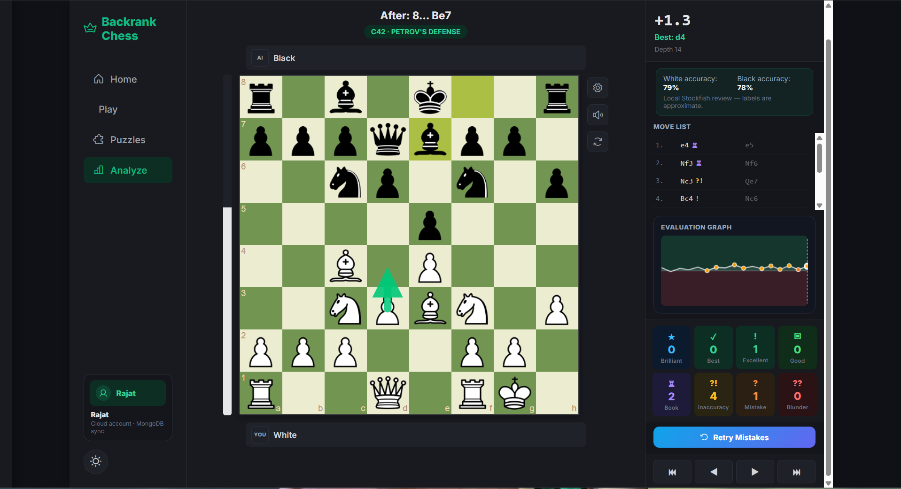
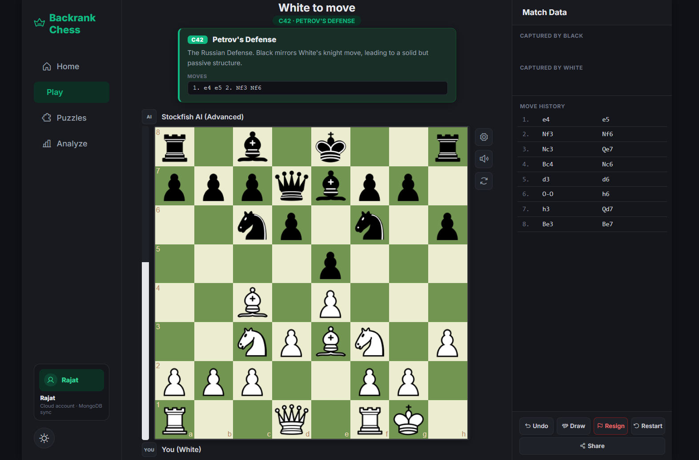

# ♔ Backrank Chess

A modern, feature-rich web chess platform built from scratch, designed for players who want to **play, practice, and analyze** their games directly in the browser.

Backrank Chess combines a clean and responsive interface with powerful chess tools, including **Stockfish-powered AI**, **interactive tactical puzzles**, **opening recognition**, and **post-game analysis**. Whether you're a beginner learning the fundamentals or an experienced player reviewing your mistakes, Backrank Chess provides an engaging chess experience without requiring any installation.

---

## 🌐 Live Demo

🔗 **Play Now:** [Add your GitHub Pages URL here]

---

## ✨ Features

### 🎮 Gameplay Modes

- **Player vs AI**
  - Challenge the Stockfish engine with multiple difficulty levels.
  - Engine calculations run inside a **Web Worker** to ensure smooth gameplay.

- **Local Player vs Player**
  - Play against friends on the same device.
  - Optional time controls for competitive games.

---

### 🤖 Stockfish Integration

- Powered by **Stockfish 10**.
- Adjustable AI difficulty levels.
- Background processing using Web Workers.
- Real-time evaluation bar during gameplay.

---

### 🧩 Tactical Puzzles

- Practice with **4,000+ Lichess puzzles**.
- Multiple difficulty categories.
- Improve pattern recognition and calculation skills.
- Public-domain puzzle database derived from Lichess.

---

### 📖 Opening Recognition

- Automatically identifies openings during games.
- Displays:
  - Opening name
  - ECO code
  - Brief description
  - Main line moves

---

### 📊 Game Analysis

Review your games like professional chess platforms.

Features include:

- Move-by-move engine evaluation
- Best move suggestions
- Accuracy estimation
- Mistake and blunder detection
- Critical moment identification
- Alternative engine lines
- Visual move annotations

---

### 🎨 Customization

Personalize your playing experience with:

- Multiple chess piece themes
- Sound themes
- Board orientation controls
- Dark mode support
- Responsive layout optimized for desktop and mobile devices

---

### ⏱ Time Controls

- Classical time controls for local multiplayer games
- Automatic timeout detection
- Active player timer highlighting

---

## 🛠 Tech Stack

### Frontend

- HTML5
- CSS3
- JavaScript (ES6)
- jQuery

### Chess Libraries

- Chess.js
- Chessboard.js
- Stockfish 10

### Backend

- Node.js
- Express.js
- Render (deployment)

### Database

- MongoDB

### Hosting

- GitHub Pages (Frontend)
- Render (Backend)

---

## 📸 Screenshots


### Home Screen



### Play Against Stockfish



### Puzzle Mode



### Analysis Board



### Opening Explorer



---

## 🚀 Getting Started

### Clone the repository

```bash
git clone https://github.com/YOUR_USERNAME/YOUR_REPOSITORY.git
cd YOUR_REPOSITORY
```

### Install backend dependencies

```bash
npm install
```

### Start the backend server

```bash
npm start
```

### Run the frontend

Open `index.html` directly in your browser, or serve it locally using:

```bash
npx serve .
```

---

## 📂 Project Structure

```text
Backrank-Chess/
│
├── index.html              # Main application interface
├── style.css               # Application styling
├── script.js               # Core gameplay logic
├── modes.js                # Analysis and additional modes
├── puzzles_lichess.js      # Puzzle database
│
├── assets/
│   ├── sounds/
│   ├── pieces/
│   └── images/
│
├── backend/
│   ├── routes/
│   ├── models/
│   └── server.js
│
└── README.md
```

---

## 🧠 How It Works

### Move Validation

All chess rules are enforced using **Chess.js**, including:

- Castling
- En passant
- Pawn promotion
- Check and checkmate detection
- Stalemate detection
- Draw conditions

---

### Engine Processing

Stockfish runs inside a **Web Worker**, preventing engine calculations from blocking the user interface.

This enables:

- Smooth animations
- Responsive controls
- Real-time evaluations

---

### Puzzle System

The puzzle trainer utilizes a curated collection of **Lichess tactical positions**, allowing players to improve through focused practice.

---

## 🎯 Future Improvements

Planned features include:

## 🚀 Future Roadmap

Planned enhancements for future versions:

- [ ] Real-time online multiplayer
- [ ] User accounts and authentication
- [ ] Cloud synchronization for games and settings
- [ ] Elo ratings and global leaderboards
- [ ] Daily puzzle challenges
- [ ] Friend system and game invitations
- [ ] Tournament support
- [ ] Advanced opening explorer with position search

---

## 🤝 Contributing

Contributions, suggestions, and feature requests are welcome.

If you'd like to improve Backrank Chess:

1. Fork the repository
2. Create a feature branch

```bash
git checkout -b feature/your-feature-name
```

3. Commit your changes

```bash
git commit -m "Add your feature"
```

4. Push to your branch

```bash
git push origin feature/your-feature-name
```

5. Open a Pull Request

---

## 📜 License

This project is licensed under the **MIT License**.

The included puzzle database is derived from **Lichess public puzzle data (CC0/Public Domain)**.

---

## 👨‍💻 Author

**Rajat Kumar**

- GitHub: https://github.com/rajat4409d-cpu
- LinkedIn: https://www.linkedin.com/in/rajat-kumar-2a56b9380/

---

## ⭐ Support the Project

If you found this project interesting or helpful, consider giving it a **star on GitHub**. It helps others discover the project and motivates future development.

---

> *"Every chess master was once a beginner."*
> — Irving Chernev